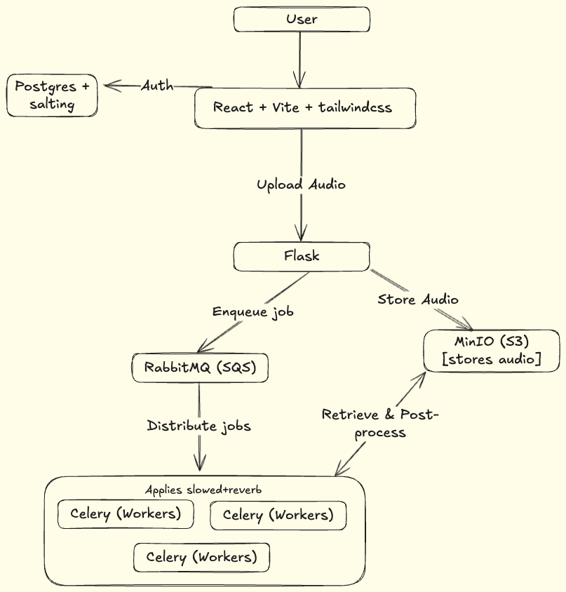

# slowedapp-argo
kind create cluster --config terraform/kind-config.yaml 
terraform apply
kubectl apply -f argo/gh-secret.yaml
kubectl apply -f argo/application.yaml
kubectl apply -f argo/external-secrets-operator-app.yaml

login to argocd and it should be working

